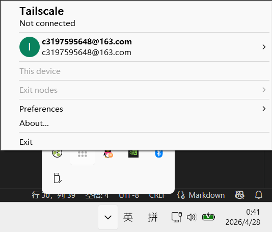
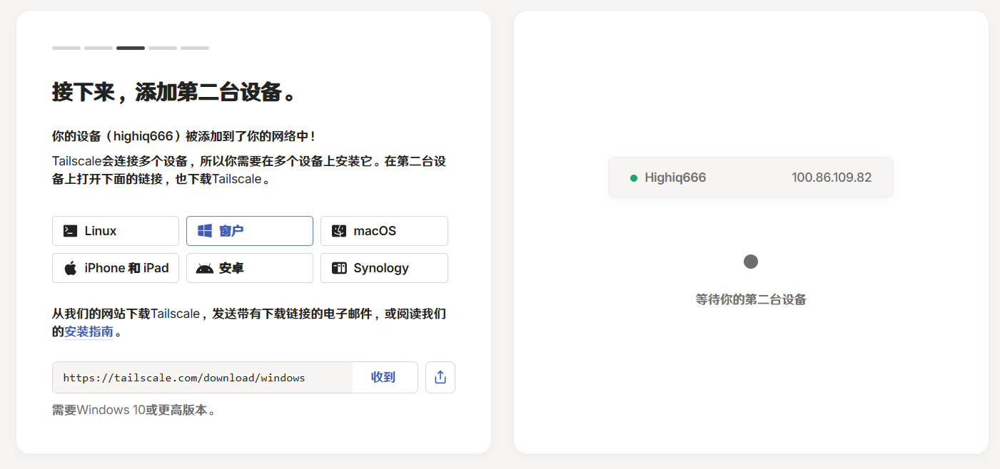

# HITMC 运维快速入门指南

HighIQ666

最后编辑于 2026-06-09

为方便新人运维上手，以及老运维再次熟悉现在的服务器架构，这里写一份简单的入门教程。

难免会有确实疏漏，欢迎各位批评指正。

## 写在前面

服务器物理机是 `Debian` 系统，配置了 `oh-my-zsh` 个性化命令行以及一些插件，对于 Linux 熟悉用户很友好

你是新人也没关系，可以 ai 搜索简单的 Linux 操作命令

插件可以在大群里喊一嗓子，问问都有哪些方便的功能

## 连接至服务器机器

主要包括**跳板机连接**和 **tailscale 直接连接**两类

### tailscale 连接

此方法较为复杂，适合有一定基础的人士查看

1. 在[注册链接](https://login.tailscale.com/login?next_url=%2Fwelcome)中选择比较稳定的第三方渠道注册
2. 在[下载链接](https://tailscale.com/download)中下载对应操作系统的客户端
3. 安装完毕后启动，一般无窗口（至少笔者在 Windows 中没有），这时一般在系统托盘之类的菜单中，如图
   
4. 在管理小群或者私聊中向 Cherrling 索要邀请链接
   1. 此处有可能报错“**等待第二台设备**”，如图
   
   2. 这时可以反馈一下，让 Cherrling 或者 zsh 协助解决
   3. 出现的原因笔者猜是需要第二套设备作为启动资金，所以如果自己有自己的其他机器的话，可以加进去，以便顺利接收邀请
5. 在 ssh 目录下生成一对密钥对，参考代码

    ```bash
    ssh-keygen -t ed25519
    ```

    `ed25519` 可以换成其他自己想取的名字
    ssh 目录，Windows 是 `C:\Users\$User_name$\.ssh` ，Linux 是 `~/.ssh`
    命令行生成时公钥私钥都会默认生成到这里面，所以生成完来这里面找就可以了
    中间问 `passphrase` 的那一步是对私钥的二次验证，可以写可以不写，其他步骤回车就行（如果已经存在他会提醒）
6. 将公钥发给 Cherrling 或者 zsh ，用于服务端配置
7. 配置完成后，可以使用下面的命令登录

    ```bash
    ssh $User_ID@manx.flicker-bass.ts.net
    ```

    或者在 `.ssh` 目录下新建 `config` 文件，填写以下内容

    ```text
    Host $Name_You_Like$
        HostName manx.flicker-bass.ts.net
        User $User_ID$
    ```

    然后可以通过下面的命令 ssh 登录

    ```bash
    ssh $Name_You_Like
    ```

这样就成功了

#### 注意事项

- 由于 ts 会改变网络配置，同时打开 tailscale 和校园网会导致**校园网几乎不可用**，其他家用网络未知
- 因此推荐不用时将 ts 关闭，避免影响正常网络使用

### 跳板机连接

此方法极为简单，推荐新手使用，以及遇到上面网络冲突问题的用户使用

1. 私聊 zsh 发送自己的用户名和邮箱，用于注册跳板机账号
2. **注意邮箱**，一般会有密码重置邮件，在里面设置自己的密码
3. 打开[跳板机网页](https://portal.zsh2517.com)登录，可以在浏览器中操作
4. 或者如下面的例子配置 ssh 连接

   在 `.ssh` 目录下新建 `config` 文件，填写以下内容

    ```text
    Host $Name_You_Like$
        HostName portal.zsh2517.com
        Port 2222
        User $User_ID$
    ```

    然后可以通过下面的命令 ssh 登录

    ```cmd
    ssh $Name_You_Like$
    ```

这样就成功了

## 了解服务器资源

在开启游戏服务器之前，要了解一下 java 位置、版本，已经开启的游戏服务器，已经占用的端口等内容，便于调用正确的 java 版本，避开端口冲突问题

### 已经开启的服务器，以及占用端口

|服务器|端口|
|---|---|
|插件服(Worker实际端口)|19199|
|插件服(Worker通信端口)|19200|
|周目 mod 服|25570|
|fabric 原版服|25571|
|GTNH|25572|
|插件服(Velocity)|25573|
|插件服(Minigames)|25579|
|插件服(Survival)|25580|
|插件服(HIT-IN-MC)|25581|
|插件服(Luck_and_Skill)|25582|
|HPM|25680|

### java 位置

java 统一储存在 `/opt` 目录下，通过**软链接**进行调用

具体版本可自行查看

若要想加新的 java 版本，或更新已有的 java ，可以联系 zsh ，或者在管理群喊一声，让有 sudo 权限的运维来更新一下

## 开服教程

这里主要提供 HITMC 自己特有的一些内容，如认证配置方法等

其他常见开服相关问题，以及各种高级操作实现方法可查阅[笨蛋开服教程](https://nitwikit.8aka.cn/java/intro/)

### 皮肤站认证配置

1. 在游戏服务器根目录下下载 `authlib-injector-x.x.x.jar` ，可以从其他已经开启的游戏服务器根目录复制一份过来。一般情况下都能用，要是版本过于落后可以访问官网链接，链接往下看
2. 安装完成后，需要在启动脚本或特定文件中配置认证登录，同时将 `server.properties` 中 `online-mode` 一项的值设为 `true`
   1. 第一种情况是启动脚本 `run.sh` 包含所有内容，可以直接在参数 `-jar` 前添加以下参数

        ```bash
        -javaagent:authlib-injector-1.2.7.jar=littleskin.cn
        ```

   2. 第二种情况是启动脚本 `run.sh` 包含 `@user_jvm_args.txt` 之类的内容，里面包括内存分配等内容，直接添加上面的参数
3. 文件编辑可以使用自己熟悉的文本编辑器，如 `vim` 等，萌新推荐使用 vim
   1. 使用下面的命令打开文件

        ```bash
        vim run.sh
        ```

   2. 按 `i` 启用编辑模式
   3. 编辑完成后按 `q` 退出编辑模式
   4. 输入 `:wq` 保存并退出，或者 `:!q` 不保存退出
   5. 更多内容可以问 ai 关于 vim 的使用方法

这样就成功了

更多内容可查看[使用手册](https://manual.littlesk.in/yggdrasil/authlib-injector)，里面包含了下载链接

Tips：一般把 `authlib-injector-x.x.x.jar` 长长的名字改成诸如 `auth.jar` 等名字，便于启动脚本的撰写，~~毕竟这一长串字符谁爱记谁记去吧~~

### server.properties 配置

1. 使用自己熟悉的文本编辑器打开 `server.properties`
2. 打开在线模式 `online-mode` ，这样才能使用认证登录
3. 在 `server-port` 为服务器设置端口，选择不会和上面冲突的端口，同时注意端口使用规则，推荐使用 `25570-25580` 中未占用的端口，这些是已经被映射出去的
4. 更改 `max-players` 项，一般是当前年份，防止人数达到上限（很少见）
5. 在 `motd` 项写点介绍服务器的内容
6. 其他项目可以查资料，根据服务器情况更改，如视距，难度，是否允许命令方块等内容
7. 推荐：把 `enforce-secure-profile` 改成 `false` ，关闭服务器对聊天签名的检测，确保所有玩家可以正常聊天交流

### 开启服务器

不要认为直接运行启动脚本，跑起来服就开了

其实这时游戏服务器是跑在你这个 `bash` 中的，当你断开 ssh 连接，你的 `bash` 就关了，服务器就会强制关闭

正确做法是打开一个 `tmux` 窗口，然后在里面开

1. 创建 `tmux` 窗口

   ```bash
   tmux new -s $Server_Name
   ```

   创建后会直接进入这个窗口
2. 进入 `tmux` 窗口

   ```bash
   tmux att -t $Name
   ```

3. 在窗口中进入游戏服务器根目录，运行启动脚本

   ```bash
   sh run.sh
   ```

4. 看着它启动完成，不放心可以输入点命令，如 `list` 判断服务器是否正常启动
5. 离开窗口，操作是 `CTRL+B` 然后按 `D`

这样就成功了

其他 `tmux` 命令可以自己查，包括上下翻页之类的命令等

### 崩溃日志处理方法

去 `crash-reports` 里面找日志，找最近的，然后可以 vim 打开后全选复制问ai，或者文件下载到本地然后把文件丢给 ai

然后根据问题选择合适的处理方法

## 文件传输方法

可以在跳板机网页界面寻找文件管理，然后可以自由下载与上传文件

普通运维只有对 `/tmp` 目录下的读写权限，所以要是想下载文件，需要先将文件移到这里

直接把文件拖动到浏览器中就可以开始上传

同样的，上传文件也是到这里，需要把文件拿出来放到想要的位置

需要注意的是，上传下载文件的带宽都很小，所以若有大文件的传递需求，可以在管理群吼一嗓子，让其他运维帮忙
